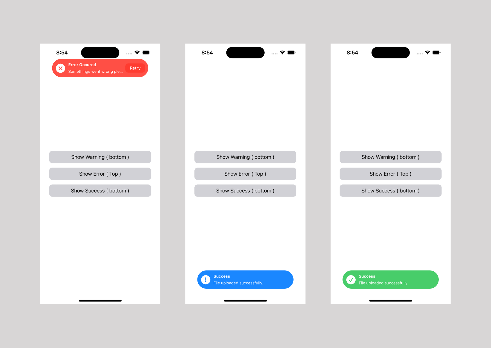

# SToastView

Swift Toast Messages is a simple and efficient library for presenting toast messages in iOS applications. Toast messages are non-intrusive notifications that provide users with brief, context-aware information.

## **Features**

- **Easy Integration:** Seamlessly integrate toast messages into your Swift iOS app with just a few lines of code.
- **Customizable:** Customize the appearance and behavior of toast messages to match your app's design and user experience.
- **Duration Control:** Set the display duration of toast messages to ensure timely information delivery.
- **Queue Management:** WIP
- **Responsive Design:** Toast messages adapt to different screen sizes and orientations.

## **Installation**

You can integrate Swift Toast Messages into your project using CocoaPods or Swift Package Manager.

### **Swift Package Manager**

In Xcode, go to `File` > `Swift Packages` > `Add Package Dependency` and enter the repository URL.

## **Usage**

1. Import the `SToastView` module.
2. Call the `SToastView` functions to display toast messages:

```swift
import SToastView 
// Display a simple toast message
let toast = SToastView()
toast.show(withMessage: "Success", description: "File uploaded successfully.", direction: .bottom) 

// Display a custom toast message with options 
let toast = SToastView()
var config = ToastConfiguration.failureConfig
config.rightButtonText = "Retry"
toast.show(withMessage: "Error Occured", description: "Somethings went wrong please try again.", configuration: config) {
    // handle retry action  
}
```

For detailed usage instructions, customization options, and more examples, refer to the *Documentation*.

## **Screenshot**

## **License**

Swift Toast Messages is released under the **MIT License**.
